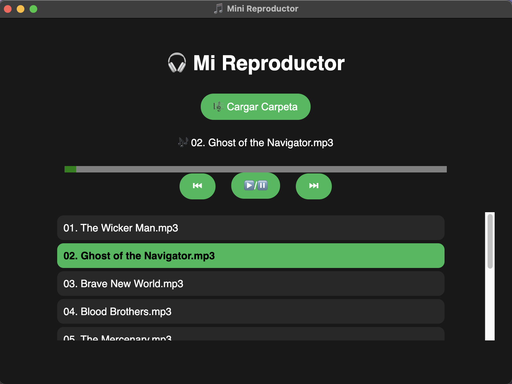

# 🎵 Mini Reproductor de Música

Una app de escritorio construida con [Electron](https://www.electronjs.org/) para reproducir tus archivos de música locales en MP3

## 🚀 Características

- Carga una carpeta de música desde tu PC
- Reproduce, pausa, avanza y retrocede canciones
- Visualiza la lista de reproducción y la canción actual
- Compatible con macOS y Windows

## 🖼️ Capturas de pantalla


## ⚙️ Instalación

```bash
git clone https://github.com/tu-usuario/mini-reproductor.git
cd mini-reproductor
npm install
npm start
```

## 🛠️ Build para crear binario
```bash
npm run build
```

## 📦 Tecnologías
Electron
HTML + CSS + JS
Node.js# reproductor-electron
